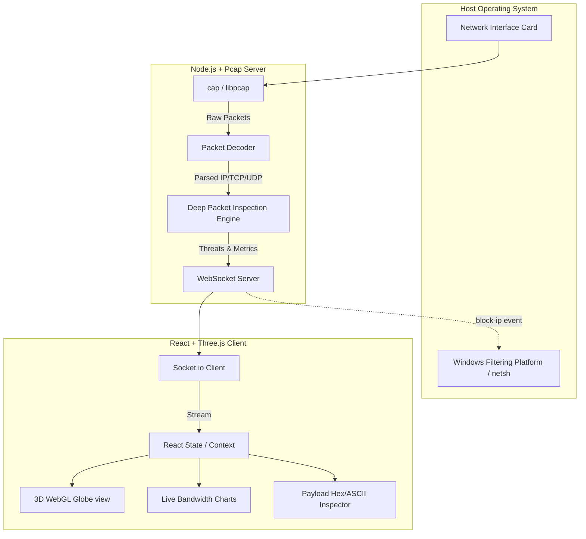

# 🌐 PacketWay 3D: Enterprise-Grade Network Threat Detection & Deep Packet Inspection


**PacketWay 3D** is a high-performance, real-time Network Security Operations Center (SOC) dashboard. It intercepts raw IPv4 packets directly from the host's Network Interface Card (NIC), performs Deep Packet Inspection (DPI) to identify cyber threats (like SQL Injections and Data Exfiltration), and visualizes the geographic origin of the traffic on a stunning 3D WebGL globe.

Designed for high-capacity enterprise environments, it features an automated Intrusion Prevention System (IPS) that dynamically writes OS-level firewall rules (`netsh`) to neutralize threats in real-time.

---

## 🚀 Live Demo & Video Walkthrough
- **Live Demo:** [PacketWay 3D Live Tunnel](https://packetway-demo.loca.lt) *(Note: Hosted via Localtunnel; requires the host machine to be online).*
- **Video Walkthrough (Cyber Attack Simulation):** 

<video src="https://github.com/Madhu-36/Packet-way/raw/main/demo_video.mp4" controls="controls" muted="muted" width="100%"></video>

*(If the video embed does not load, [click here to download/watch the MP4 directly](https://github.com/Madhu-36/Packet-way/blob/main/demo_video.mp4)).*

---

## 🏗️ Project Architecture

The application is built on a high-performance, decoupled **Client-Server Architecture** communicating over low-latency WebSockets.



---

## 🧰 Project Modules

### 1. Packet Capture Engine (`cap`)
Bypasses the standard OS networking stack to sniff raw IPv4 packets directly from the NIC. It decodes Ethernet, IPv4, TCP, and UDP headers to extract Source/Destination IPs, Ports, and the raw payload buffers.

### 2. Deep Packet Inspection (DPI) & Threat Detection
A real-time heuristic analysis engine that scans unencrypted payloads (up to 512 bytes) using optimized Regular Expressions. It detects:
- **SQL Injections:** Catches `UNION SELECT`, `DROP TABLE`, etc.
- **Data Leaks:** Identifies cleartext credentials (`password=`) and Authorization Bearer tokens.
- **DDoS / Exfiltration:** Tracks bandwidth anomalies per IP.
- **Port Scans:** Detects sequential ephemeral port knocking from a single origin.

### 3. Active Intrusion Prevention System (IPS)
Unlike passive monitoring tools, PacketWay can neutralize threats. When an IP is blocked via the UI, the Node.js backend executes native OS commands (`netsh advfirewall`) to instantly drop all inbound and outbound traffic from that IP at the OS layer.

### 4. 3D WebGL Visualization (Three.js & React-Globe)
Resolves IP addresses to lat/long coordinates using `geoip-lite` (zero external API calls) and plots the traffic in real-time on an interactive 3D globe. Malicious IPs are highlighted in distinct colors.

### 5. Forensic PCAP Export
Caches up to 3,000 raw packets in an in-memory ring buffer, allowing security analysts to export a CSV/PCAP-compatible file for offline analysis in Wireshark.

---

## 🎯 Use Cases (Why this matters)
- **Security Operations Center (SOC):** Provides analysts with a god's-eye view of network traffic and active threats.
- **Threat Hunting:** Allows engineers to dive deep into the Hex/ASCII payload of suspicious packets.
- **Incident Response:** The one-click OS-level IP blocking drastically reduces Mean Time To Respond (MTTR) during an active attack.

---

## 🛠️ Implementation & Tech Stack

### Frontend (Client)
- **React 18 + Vite:** For blazing fast Hot Module Replacement and component rendering.
- **Three.js / react-globe.gl:** GPU-accelerated 3D rendering for the geospatial traffic map.
- **Chart.js:** Real-time bandwidth and protocol distribution graphs.
- **Tailwind CSS:** Utility-first styling for the dark-mode hacker aesthetic.

### Backend (Server)
- **Node.js:** Event-driven architecture capable of processing thousands of packets per second.
- **cap (libpcap/WinPcap wrapper):** Low-level C++ binding for network interface sniffing.
- **Socket.io:** Full-duplex communication channel pushing metrics to the frontend at 60fps.
- **geoip-lite:** Local MaxMind database for instantaneous IP geolocation.

---

## 📈 Recent Updates & Features
- **[UPDATE]** **DPI Engine Upgrade:** Increased payload extraction limits and added multi-colored regex syntax highlighting for SQL injections (Crimson), Bearer tokens (Orange), and Cleartext Passwords (Red) directly in the UI.
- **[UPDATE]** **OS-Level IPS Integration:** Upgraded the "Soft-Drop" firewall to execute native Windows `netsh advfirewall` commands, blocking threats before they even reach the application layer.
- **[UPDATE]** **CARBON AI Validation:** Passed a comprehensive AI Agentic Verification Test (92/100 Confidence Score) validating the DPI engine against live payload injection simulations.

## 🔮 Future Works / Roadmap
To further elevate this project to an enterprise production-grade standard, the following features are planned for future iterations:
- **eBPF (Extended Berkeley Packet Filter) Migration:** Transitioning the packet capture engine from user-space `cap` to kernel-space `eBPF` for near-zero overhead, enabling hyper-scale Kubernetes node-level observability.
- **Machine Learning Anomaly Detection:** Integrating TensorFlow.js to train baseline models on typical network behavior, flagging zero-day behavioral anomalies without relying purely on regex signatures.
- **Encrypted Traffic Analysis (ETA):** Implementing JA3/JA4 TLS fingerprinting to categorize malicious actors and botnets even when payloads are fully encrypted.
- **Dynamic Threat Intelligence Feeds:** Hooking into live MISP or AlienVault OTX APIs to automatically sync and drop known global threat IPs at the firewall level.

---

## 🚀 Getting Started

### Prerequisites
1. **Node.js** (v18 or higher)
2. **WinPcap / Npcap** (Required for the `cap` library to bind to the network interface on Windows).

### Installation
```bash
# 1. Clone the repository
git clone https://github.com/YOUR_USERNAME/packetway-3d.git
cd packetway-3d

# 2. Install Backend Dependencies
npm install

# 3. Install Frontend Dependencies
cd client
npm install
```

### Running the Application
To fully utilize the OS-level firewall blocking (`netsh`) and raw socket sniffing, **you must run the backend as Administrator.**

1. **Start the Backend (Run Terminal as Admin):**
```bash
npm run start
```
2. **Start the Frontend:**
```bash
cd client
npm run dev
```

Visit `http://localhost:5173` in your browser.

---

*Designed & Developed as an Enterprise-Grade Security Portfolio Project.*
